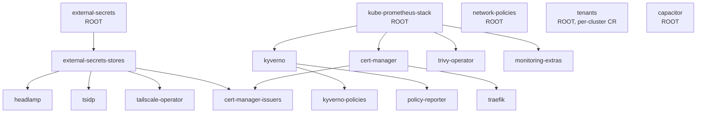

# Architecture

This is the deep architecture reference for the fleet. For a faster orientation
see the [docs index](README.md) and the [top-level README](../README.md). For
day-2 procedures (bootstrap, reconcile, validation) see [operations.md](operations.md).

## The fleet-repo model

The repository follows the fleet-repo layout from the platform spec: Terraform
owns infrastructure (nodes, Cilium CNI, Vault), and **Flux owns everything inside
Kubernetes**, organized as `platform/{fleet,base,overlays}` + `tenants/{base,overlays}`.

The core idea is that the reconcile graph is defined **once** for the whole fleet,
not copied per cluster:

| Layer | Path | Role |
|-------|------|------|
| **clusters/** | `clusters/<name>/` | Thin per-cluster entry points. Each holds its `flux-system/` bootstrap (generated by `flux bootstrap`, do not hand-edit), a `cluster-vars.yaml` ConfigMap of per-cluster substitution values, a `kustomization.yaml` listing which fleet components this cluster runs, and any genuinely per-cluster Flux `Kustomization` CRs (`tenants.yaml`, and test-home's `external-secrets-stores.yaml`). |
| **platform/fleet/** | `platform/fleet/*.yaml` | The reconcile graph: **one Flux `Kustomization` CR per component**, with the `dependsOn` ordering edges, defined once. `kustomization.yaml` aggregates the whole component set (the "run everything" list); `_defaults.yaml` is strategic-merged onto every component so each file declares only what differs. |
| **platform/base/** | `platform/base/<component>/` | Reusable Kustomize bases — typically `namespace.yaml` + `source.yaml` (`HelmRepository`) + `release.yaml` (`HelmRelease`), plus any extra manifests (ExternalSecrets, RBAC, Ingress, dashboards). A fleet `Kustomization` reconciles a base directly via its `spec.path`. |
| **platform/overlays/** | `platform/overlays/<cluster>/<component>/` | Reserved for **structural** per-cluster differences only, not value swaps. Today the only overlay is `overlays/test-home/external-secrets-stores`. |
| **tenants/** | `tenants/{base,overlays}/` | Per-tenant namespaces, RBAC, and the Flux sources/Kustomizations each tenant manages. Reconciled per cluster from `tenants/overlays/<cluster>` via `clusters/<name>/tenants.yaml`. |

Adding a region is `flux bootstrap` (writes `flux-system/`) + a `cluster-vars.yaml`
+ a `kustomization.yaml` listing components — the reconcile graph is referenced,
never copied.

## The per-cluster variation rule

The single rule that governs where per-cluster differences live:

> **Per-cluster *values* go in `cluster-vars` and are applied via `${var}`
> substitution. Per-cluster *structure* gets an overlay plus a per-cluster Flux
> `Kustomization` CR.**

This keeps the shared component definitions free of environment-specific config
without adding empty pass-through layers.

### Values: `cluster-vars` ConfigMap + `${var}` postBuild substitution

Base manifests carry `${var}` tokens; the fleet `Kustomization` for that component
sets `postBuild.substituteFrom: [{kind: ConfigMap, name: cluster-vars}]`, and Flux
substitutes the token **in-cluster** from each cluster's `cluster-vars` ConfigMap.

`clusters/prod-fsn/cluster-vars.yaml` carries `cluster_name: prod-fsn`;
`clusters/test-home/cluster-vars.yaml` carries `cluster_name: test-home`. Concrete
substitutions of `${cluster_name}`:

| Base manifest | Token use | Result on prod-fsn |
|---------------|-----------|--------------------|
| `platform/base/tailscale-operator/release.yaml` | `hostname: k8s-api-${cluster_name}` (the operator device is the API-server proxy endpoint) | `k8s-api-prod-fsn` |
| `platform/base/external-secrets-stores/cluster-secret-store.yaml` | `mountPath: kubernetes/${cluster_name}` (per-cluster Vault kubernetes-auth mount) | `kubernetes/prod-fsn` |

A second, **fleet-wide** ConfigMap, `platform/fleet/fleet-vars.yaml`, holds values
that are the same on every cluster (currently `tailnet: penguin-bigeye`, used to
build `idp.<tailnet>.ts.net` / `grafana.<tailnet>.ts.net`). It is **not** part of
`platform/fleet/kustomization.yaml`; each cluster that runs a component reading
`${tailnet}` (kube-prometheus-stack, headlamp) references the file directly from
its own `kustomization.yaml`.

### Structure: overlay + per-cluster Flux Kustomization CR

When the difference is structural (a manifest needs different fields, not just a
different value), substitution can't help — and crucially **a Flux `Kustomization`'s
`spec.path` cannot be `${var}`-substituted**, so the cluster needs its own
`Kustomization` CR pointing at the overlay.

The one live example is **test-home's external-secrets-stores**:

- test-home runs on a home LAN, so its apiserver isn't reachable from
  `vault.rosenvold.tech`, and Vault's Kubernetes auth (which issues a TokenReview
  callback on Vault ≥ 1.16) fails with 403.
- `platform/overlays/test-home/external-secrets-stores/kustomization.yaml` patches
  the base `ClusterSecretStore`: it **removes** the `spec.provider.vault.auth.kubernetes`
  block and **adds** an `appRole` block (role_id/secret_id from the `vault-approle`
  Secret, written by Terraform).
- Because `spec.path` can't be substituted, test-home keeps its own
  `clusters/test-home/external-secrets-stores.yaml` Flux `Kustomization` pointing
  at that overlay (`path: ./platform/overlays/test-home/external-secrets-stores`),
  instead of using the shared `platform/fleet/external-secrets-stores.yaml`.

The same `spec.path`-can't-be-substituted reason is why `tenants` is a per-cluster
`Kustomization` (`clusters/<name>/tenants.yaml`, pointing at
`tenants/overlays/<cluster>`) rather than living in `platform/fleet/`.

## The reconcile / `dependsOn` graph

The graph is defined once in `platform/fleet/`. The roots have **no `dependsOn`**;
everything else chains off them. Each component also inherits `wait: true` and
`prune: true` from `_defaults.yaml`.



### Roots (no `dependsOn`)

- **external-secrets** — ESO controller + CRDs that every Vault-backed secret builds on.
- **kube-prometheus-stack** — installs the Prometheus-Operator `ServiceMonitor`/`PodMonitor` CRDs, so it reconciles first among monitored components.
- **network-policies** — the Cilium cluster-wide default-deny. No `dependsOn`, but needs the Cilium CRDs that Terraform installs out-of-band.
- **tenants** — per-cluster `Kustomization` (see above); root of the tenant apps.
- **capacitor** — Flux GitOps dashboard; a standalone root.

### Ordering rules (verified against `platform/fleet/*.yaml`)

| Rule | Edges (`dependsOn`) | Why |
|------|---------------------|-----|
| **Prometheus-Operator CRDs first** | `kyverno`, `cert-manager`, `trivy-operator`, `monitoring-extras` → `kube-prometheus-stack` | Each ships a ServiceMonitor/PodMonitor (or PrometheusRule); those CRDs must exist before the monitor can apply. (`trivy-operator.yaml` confirms it depends on `kube-prometheus-stack`, not on anything else.) |
| **Kyverno before its policies/reporter** | `kyverno-policies`, `policy-reporter` → `kyverno` | `ClusterPolicy` and `PolicyReport` are Kyverno CRDs; the controller must be installed first. |
| **Secret stores before consumers** | `external-secrets-stores` → `external-secrets`; then `headlamp`, `tsidp`, `tailscale-operator`, `cert-manager-issuers` → `external-secrets-stores` | The `ClusterSecretStore` is an ESO CRD (needs the controller); everything that reads a Vault-synced secret needs the store to exist. |
| **cert-manager before issuers/ingress** | `cert-manager-issuers` → `cert-manager` (and `external-secrets-stores`); `traefik` → `cert-manager` | `ClusterIssuer` is a cert-manager CRD. `cert-manager-issuers` keeps `wait: true`, so it only reads Ready once the issuers register with ACME (the Cloudflare DNS-01 token comes from Vault, hence its second edge to `external-secrets-stores`). Traefik serves TLS from cert-manager-issued certs. |

Note that `cert-manager-issuers` has **two** parents (`cert-manager` and
`external-secrets-stores`) — it sits at the join of the cert-manager chain and the
secret-store chain.

## prod-fsn (full fleet) vs test-home (subset)

How each cluster selects components is just how its `kustomization.yaml` references
`platform/fleet/`:

**`clusters/prod-fsn/kustomization.yaml`** runs the **whole fleet** — it references
the entire `../../platform/fleet` directory (which aggregates every component and
applies `_defaults.yaml` to all of them):

```yaml
resources:
  - flux-system
  - cluster-vars.yaml
  - ../../platform/fleet/fleet-vars.yaml   # ${tailnet}, referenced directly
  - tenants.yaml
  - ../../platform/fleet                   # the whole reconcile graph
```

**`clusters/test-home/kustomization.yaml`** runs a **deliberate subset** — it lists
individual fleet files instead of the directory, and re-applies `_defaults.yaml`
itself (since it isn't pulling in `platform/fleet/kustomization.yaml`, which is what
applies that patch for prod-fsn):

```yaml
resources:
  - flux-system
  - cluster-vars.yaml
  - ../../platform/fleet/capacitor.yaml
  - ../../platform/fleet/external-secrets.yaml
  - ../../platform/fleet/tailscale-operator.yaml
  - external-secrets-stores.yaml    # local AppRole override, NOT the shared fleet file
  - tenants.yaml
patches:
  - path: ../../platform/fleet/_defaults.yaml
    target: { group: kustomize.toolkit.fluxcd.io, version: v1, kind: Kustomization }
```

test-home thus runs `capacitor`, `external-secrets`, `tailscale-operator`, its own
AppRole `external-secrets-stores`, and `tenants` — and pointedly **not** the shared
`platform/fleet/external-secrets-stores.yaml` (it uses the structural override
described above). prod-fsn currently has a `tenants.yaml`; test-home's `tenants`
overlay is empty until a tenant is onboarded.

## Adding a new cluster / new component

Brief — see [operations.md](operations.md) for the full procedure.

**New cluster:** `flux bootstrap` writes `clusters/<name>/flux-system/`; add a
`cluster-vars.yaml` (at minimum `cluster_name`); add a `kustomization.yaml` listing
the fleet components it runs (either the whole `../../platform/fleet` directory, or
individual files plus the `_defaults.yaml` patch); add per-cluster CRs (`tenants.yaml`,
and any structural override) as needed. The reconcile graph is referenced, never copied.

**New component:** add `platform/base/<component>/` (namespace + source + release +
extras), add `platform/fleet/<component>.yaml` (a Flux `Kustomization` declaring
`path`, any `dependsOn`, and `postBuild` substitution), list it in
`platform/fleet/kustomization.yaml`, and make sure each cluster's `kustomization.yaml`
includes it. If the new namespace is a platform namespace it must also be added to
the guardrail exclusion lists — see [networking.md](networking.md) and
[policies.md](policies.md).

## Scaffolded stubs

`netdata` and `vector` have component **bases** under `platform/base/` but **no
fleet `Kustomization`** today, so Flux does not reconcile them. To enable one, add
`platform/fleet/<name>.yaml`, list it in `platform/fleet/kustomization.yaml`, fill
in the cluster-specific config (e.g. the Humio sink for vector), and include it in
the cluster's `kustomization.yaml`. These stubs are intentionally not part of the
reconcile graph above.
